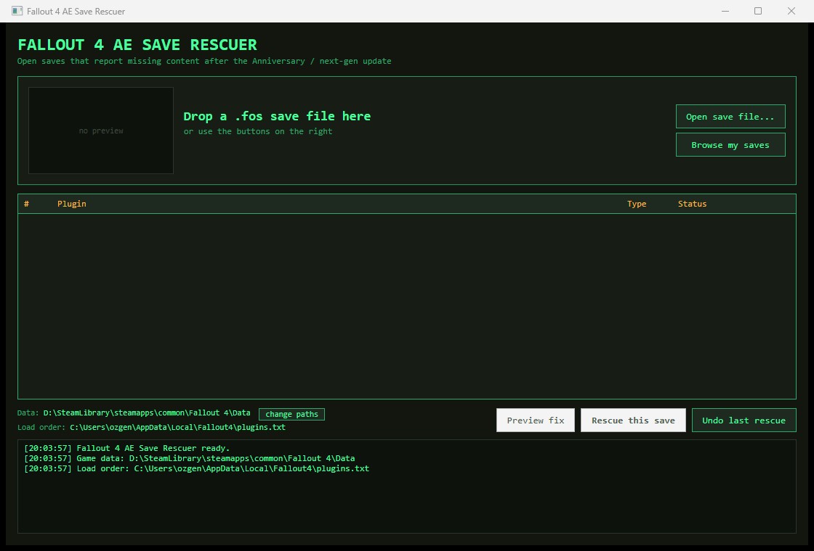

# Fallout 4 AE Save Rescuer

Open Fallout 4 saves that refuse to load after the Anniversary / next-gen update, without
reinstalling the mods they were built with.



## The problem

A save file records every plugin that was active when it was written. If some of those plugins
are no longer installed, the game is supposed to show a "this save is missing content" warning
and let you continue anyway.

On current game versions that path is unreliable: the warning appears, the interface starts
misbehaving, and the game often ends up on the Creations page instead of loading the save.
The result is a character you cannot reach any more.

## The solution

The warning only exists because the game cannot find plugins the save lists. This tool creates
an **empty placeholder plugin** for each missing name, so the game finds everything it looks for
and loads the save normally.

What that means in practice:

* The save loads without the warning dialog, so the broken path is never entered.
* Content from the missing mods is simply gone from the save - weapons, armour, settlement
  pieces from those mods disappear. Everything else (your character, level, progress,
  and every mod you still have installed) stays intact.
* Load-order positions are preserved, so form IDs from your remaining mods do not shift.
* Nothing is destructive: real plugins are never overwritten, the load order is backed up
  before it is touched, and one button undoes the whole operation.

## Usage

1. Close Fallout 4 (the game keeps its plugin files locked while it runs).
2. Start `FO4SaveRescuer.exe`.
3. Drag a `.fos` save onto the window, or use **Open save file...** / **Browse my saves**.
4. Check the plugin table: missing entries are highlighted, entries that exist but are not
   enabled are flagged too.
5. Press **Preview fix** to see what would change, then **Rescue this save** to apply it.
6. Launch the game and load the save.

**Undo last rescue** removes the placeholders it created and restores the previous load order.

### Paths

The tool detects the game's `Data` folder, the active `plugins.txt` and your saves folder
automatically. Use **change paths** if you keep things elsewhere - Mod Organizer 2 profiles are
detected and listed, since each profile has its own load order file.

### A note on placeholders

Placeholders are minimal but valid plugin files: a header, no records, and a marker identifying
them as generated. The tool only ever deletes files carrying that marker, so if you later install
the real mod over a placeholder, your file is left alone.

## Requirements

* Windows
* Fallout 4 (tested against the current next-gen builds and older 1.10.x saves)
* No script extender, no in-game dependency; the tool never touches the save file itself

## Building from source

```
dotnet build
dotnet test
dotnet publish src/SaveRescuer.App -c Release -r win-x64 --self-contained true ^
  -p:PublishSingleFile=true -p:IncludeNativeLibrariesForSelfExtract=true
```

Layout:

```
src/SaveRescuer.Core   save parsing, environment discovery, placeholder + load-order logic
src/SaveRescuer.App    WPF interface
tests/SaveRescuer.Tests unit tests (synthetic saves, no game data needed)
```

## Releases

Pushing a tag such as `v1.0.0` builds and publishes a self-contained Windows executable through
GitHub Actions; see `.github/workflows/release.yml`.

## Limitations

* Content from missing mods cannot be recovered - this makes the save openable, not complete.
* If your character is standing inside a location added by a missing mod, the game may not be
  able to place them. Load an earlier save, or teleport to a vanilla location from the console.
* Saves themselves are never modified. For cleaning orphaned script data out of a save, use a
  dedicated save editor.

## License

MIT - see [LICENSE](LICENSE).
